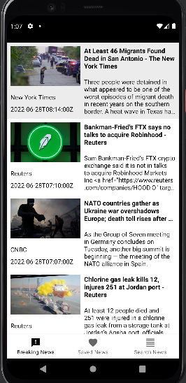
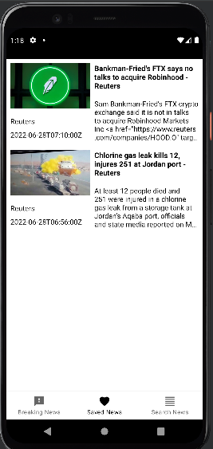

# NewsApp
Приложение NewsApp предназначен для чтения новостей. Приложение использует сторонний API.
Вот как выглядит приложение.

При нажатии на какую-то новость открывается другое окно, где можно прочесть новость.

Нажав на кнопку с иконкой сердце новость добавляется в "Избранное".
Чтобы посмотреть сохраненные новости нужно перейти на "Saved news".

Можно также найти какие-нибудь новости.

